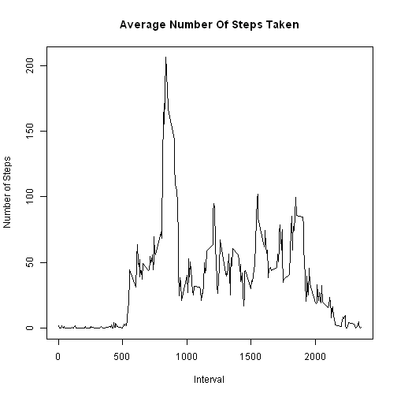

# Reproducible Research: Peer Assessment 1


## Loading and preprocessing the data

Data is loaded from the file "activity.csv" file from the default directory.  The file was originally downloaded from: https://d396qusza40orc.cloudfront.net/repdata%2Fdata%2Factivity.zip
The date column is converted to a format easier to work with.


```r
setwd('C:\\Reproducible Research\\Proj1')

proj1 <- read.csv("activity.csv",  header=TRUE, sep=",", colClasses = c("numeric", "character", "numeric"))
proj1$date <- as.Date(proj1$date, format="%Y-%m-%d")

head(proj1)
```

```
##   steps       date interval
## 1    NA 2012-10-01        0
## 2    NA 2012-10-01        5
## 3    NA 2012-10-01       10
## 4    NA 2012-10-01       15
## 5    NA 2012-10-01       20
## 6    NA 2012-10-01       25
```

## What is mean total number of steps taken per day?

We must summarize by "date" to keep track of the total number of steps per day.


```r
byDay <- tapply(proj1$steps, proj1$date, FUN=sum, na.rm = TRUE)
```

A histogram for total steps by day:

```r
plot(as.Date(names(byDay)), byDay, type="l", ylab = "Number of Steps", xlab = "Date", main="Total Steps Taken By Day")
```

 

Mean number of steps taken per day:

```r
mean_byDay <- tapply(proj1$steps, proj1$date, FUN=mean, na.rm = TRUE)
mean_byDay
```

```
## 2012-10-01 2012-10-02 2012-10-03 2012-10-04 2012-10-05 2012-10-06 
##        NaN     0.4375    39.4167    42.0694    46.1597    53.5417 
## 2012-10-07 2012-10-08 2012-10-09 2012-10-10 2012-10-11 2012-10-12 
##    38.2465        NaN    44.4826    34.3750    35.7778    60.3542 
## 2012-10-13 2012-10-14 2012-10-15 2012-10-16 2012-10-17 2012-10-18 
##    43.1458    52.4236    35.2049    52.3750    46.7083    34.9167 
## 2012-10-19 2012-10-20 2012-10-21 2012-10-22 2012-10-23 2012-10-24 
##    41.0729    36.0938    30.6285    46.7361    30.9653    29.0104 
## 2012-10-25 2012-10-26 2012-10-27 2012-10-28 2012-10-29 2012-10-30 
##     8.6528    23.5347    35.1354    39.7847    17.4236    34.0938 
## 2012-10-31 2012-11-01 2012-11-02 2012-11-03 2012-11-04 2012-11-05 
##    53.5208        NaN    36.8056    36.7049        NaN    36.2465 
## 2012-11-06 2012-11-07 2012-11-08 2012-11-09 2012-11-10 2012-11-11 
##    28.9375    44.7326    11.1771        NaN        NaN    43.7778 
## 2012-11-12 2012-11-13 2012-11-14 2012-11-15 2012-11-16 2012-11-17 
##    37.3785    25.4722        NaN     0.1424    18.8924    49.7882 
## 2012-11-18 2012-11-19 2012-11-20 2012-11-21 2012-11-22 2012-11-23 
##    52.4653    30.6979    15.5278    44.3993    70.9271    73.5903 
## 2012-11-24 2012-11-25 2012-11-26 2012-11-27 2012-11-28 2012-11-29 
##    50.2708    41.0903    38.7569    47.3819    35.3576    24.4688 
## 2012-11-30 
##        NaN
```

Median number of steps taken per day:

```r
median_byDay <- tapply(proj1$steps, proj1$date, FUN=median, na.rm = TRUE)
median_byDay
```

```
## 2012-10-01 2012-10-02 2012-10-03 2012-10-04 2012-10-05 2012-10-06 
##         NA          0          0          0          0          0 
## 2012-10-07 2012-10-08 2012-10-09 2012-10-10 2012-10-11 2012-10-12 
##          0         NA          0          0          0          0 
## 2012-10-13 2012-10-14 2012-10-15 2012-10-16 2012-10-17 2012-10-18 
##          0          0          0          0          0          0 
## 2012-10-19 2012-10-20 2012-10-21 2012-10-22 2012-10-23 2012-10-24 
##          0          0          0          0          0          0 
## 2012-10-25 2012-10-26 2012-10-27 2012-10-28 2012-10-29 2012-10-30 
##          0          0          0          0          0          0 
## 2012-10-31 2012-11-01 2012-11-02 2012-11-03 2012-11-04 2012-11-05 
##          0         NA          0          0         NA          0 
## 2012-11-06 2012-11-07 2012-11-08 2012-11-09 2012-11-10 2012-11-11 
##          0          0          0         NA         NA          0 
## 2012-11-12 2012-11-13 2012-11-14 2012-11-15 2012-11-16 2012-11-17 
##          0          0         NA          0          0          0 
## 2012-11-18 2012-11-19 2012-11-20 2012-11-21 2012-11-22 2012-11-23 
##          0          0          0          0          0          0 
## 2012-11-24 2012-11-25 2012-11-26 2012-11-27 2012-11-28 2012-11-29 
##          0          0          0          0          0          0 
## 2012-11-30 
##         NA
```

## What is the average daily activity pattern?

A histogram for total steps by interval:

```r
five_min_intervals <- tapply(proj1$steps, proj1$interval, FUN=mean, na.rm = TRUE)

plot(as.numeric(names(five_min_intervals)), five_min_intervals, type="l", ylab = "Number of Steps", xlab = "Interval", main="Average Number Of Steps Taken")
```

 

The 5-minute interval with the most activity:


```r
five_min_intervals[which.max(five_min_intervals)]
```

```
##   835 
## 206.2
```


## Imputing missing values

Total missing values:

```r
number_of_NAs <- sum(is.na(proj1$steps))
number_of_NAs
```

```
## [1] 2304
```

Copy original dataset and fill in missing values.  I did a median(five_min_intervals) and came up with a value of 34.

```r
imputed_proj1 <- proj1
for (i in 1:length(imputed_proj1$steps)) {
    if (is.na(imputed_proj1$steps[i])) {
        imputed_proj1$steps[i] = 34
    }
}
```

A histogram of the total number of steps taken each day and Calculate and report the mean and median total number of steps taken per day.

```r
imputed_byDay <- tapply(imputed_proj1$steps, imputed_proj1$date, FUN=sum, na.rm = TRUE)

imputed_mean_steps <- tapply(imputed_proj1$steps, imputed_proj1$date, FUN=mean, na.rm = TRUE)
imputed_median_steps <- tapply(imputed_proj1$steps, imputed_proj1$date, FUN=median, na.rm = TRUE)

imputed_five_min_intervals <- tapply(imputed_proj1$steps, imputed_proj1$interval, FUN=mean, na.rm = TRUE)

plot(as.numeric(names(imputed_five_min_intervals)), imputed_five_min_intervals, type="l", ylab = "Number of Steps", xlab = "Interval", main="(Imputed) Average Number Of Steps Taken")
```

 

## Are there differences in activity patterns between weekdays and weekends?  Add a column to denote weekend.

```r
imputed_proj1$weekday <- weekdays(imputed_proj1$date) == "Saturday" | weekdays(imputed_proj1$date) == "Sunday"

imputed_Weekends <- subset(imputed_proj1, weekday == "TRUE")
imputed_Weekdays <- subset(imputed_proj1, weekday == "FALSE")

weekend_imputed_five_min_intervals <- tapply(imputed_Weekends$steps, imputed_Weekends$interval, FUN=mean, na.rm = TRUE)
weekday_imputed_five_min_intervals <- tapply(imputed_Weekdays$steps, imputed_Weekdays$interval, FUN=mean, na.rm = TRUE)

par(mfrow = c(2, 1))
plot(as.numeric(names(weekend_imputed_five_min_intervals)), weekend_imputed_five_min_intervals, type="l", ylab = "Number of Steps", xlab = "Interval", main="weekend")
plot(as.numeric(names(weekday_imputed_five_min_intervals)), weekday_imputed_five_min_intervals, type="l", ylab = "Number of Steps", xlab = "Interval", main="weekday")
```

 
